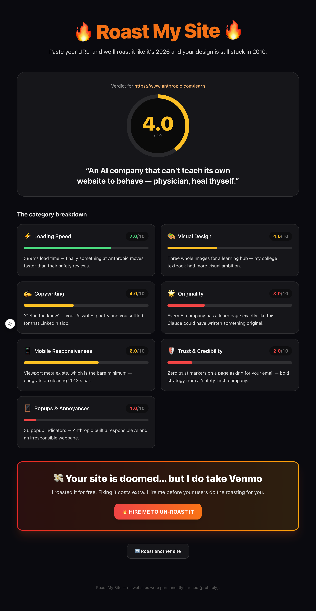

# 🔥 Roast My Site 🔥

Paste a website URL and let an AI return a brutally funny critique of it, plus an overall score. The roast is broken into seven fixed categories — each scored and commented independently — then aggregated into a final verdict.

> The full product vision (and savage tone) lives in [`roast_my_site_spec.md`](./roast_my_site_spec.md).

## Example

<p align="center">
  
</p>

## The roast categories

- ⚡ Loading Speed
- 🎨 Visual Design
- ✍️ Copywriting
- 🌟 Originality
- 📱 Mobile Responsiveness
- 🛡️ Trust & Credibility
- 🪟 Popups & Annoyances

## Stack

- **Next.js 15** (App Router) + **React 19**
- **TypeScript** (strict)
- **Tailwind CSS v3**
- **Anthropic SDK** (`@anthropic-ai/sdk`) for the AI roast
- **Vitest** for tests

## Getting started

One command installs dependencies and starts the dev server:

```bash
npm run up
```

Then open [http://localhost:3000](http://localhost:3000).

> Prefer the steps separately? `npm install` then `npm run dev`.
> To install, build, and serve a production build in one go: `npm run serve`.

### Environment

Copy `.env.example` and set your key:

```bash
ANTHROPIC_API_KEY=sk-ant-...
```

`ANTHROPIC_API_KEY` is **optional**. When it's absent (or the Claude API errors), the app falls back to a deterministic mock roast engine, so it always works offline and the `/api/roast` route never 500s on AI issues.

## Scripts

| Command | Description |
| --- | --- |
| `npm run up` | Install deps + start the dev server (one command) |
| `npm run serve` | Install deps + production build + serve |
| `npm run dev` | Start the dev server |
| `npm run build` | Production build |
| `npm start` | Run the production server |
| `npm run lint` | ESLint |
| `npm run typecheck` | `tsc --noEmit` |
| `npm test` | Run the Vitest suite |
| `npm run test:watch` | Vitest in watch mode |

## Project structure

```
src/
├── app/                  # Next.js App Router
│   ├── api/roast/        # POST /api/roast route (+ colocated test)
│   ├── layout.tsx
│   ├── page.tsx
│   └── globals.css
├── components/           # UI: RoastForm, FinalVerdict, ScoreGauge,
│                         #     CategoryCard, PaidCta
└── lib/                  # analyze.ts, roast.ts, types.ts (+ colocated tests)
```

Config files (`next.config.mjs`, `tailwind.config.ts`, `postcss.config.mjs`,
`tsconfig.json`, etc.) live at the repo root, as Next.js and its tooling expect.

### Data flow

URL input (`RoastForm`) → `POST /api/roast` → `analyzeSite()` fetches the target
page and extracts heuristic `SiteSignals` → `generateRoast()` produces a
`RoastResult` (via Claude when `ANTHROPIC_API_KEY` is set, otherwise the mock
engine) → results rendered by `FinalVerdict` (a `ScoreGauge` + seven
`CategoryCard`s) plus `PaidCta`.

The seven fixed categories and shared types (`CategoryKey`, `CATEGORY_META`,
`SiteSignals`, `RoastResult`) live in `src/lib/types.ts` — they are the contract
between the analysis/roast backend and the results UI.

## Tests

Tests use Vitest and are colocated next to the code as `*.test.ts`. Run them with `npm test`.

---

💸 *Your site is doomed... unless you pay us to fix it. Professional roast recovery service available, starting at $999. (Just kidding... or are we?)*
